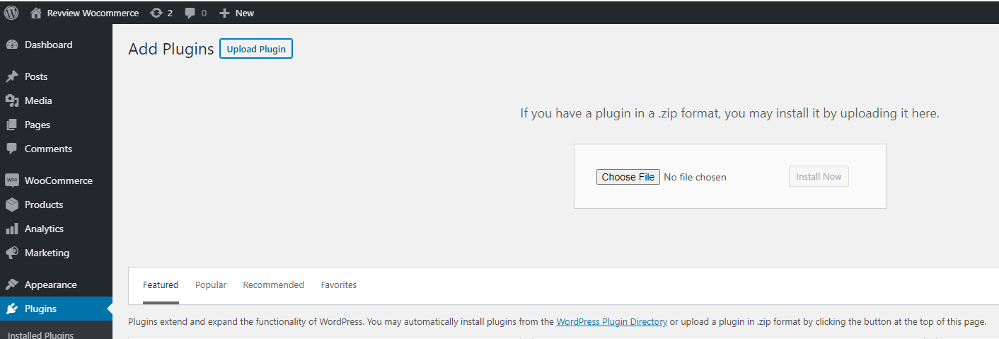
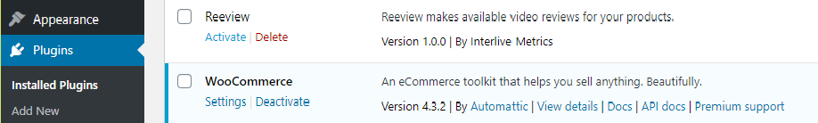
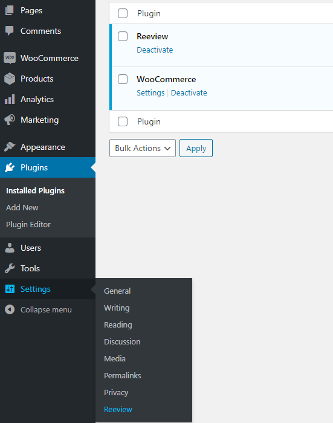
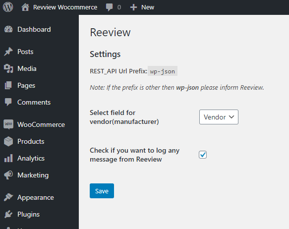

# Reeview  
Contributors: Reeview Inc.  
Donate link:
Tags: reeview, woocommerce
Requires at least: 4.0
Tested up to: 5.5.1
Stable tag: 1.0.0
Requires PHP:
License: GPLv2 or later
License URI: https://www.gnu.org/licenses/gpl-2.0.html

Connect your WooCommerce store with Reeview, providing Youtube reviews for products straight to your shoppers.

## Description

**What is Reeview?**  
Reeview is the world’s first video delivery system that automatically searches and serves your Youtube product reviews, straight to your shoppers. 
Control the conversation and keep shoppers on your site with a ground-breaking widget that will revolutionize how you use video.
This plugin is an WooCommerce extension that will connect your store with Reeview.  

**External service**  
This plugin will require you to have a Reeview account. If you don't have an account yet here's a link to our website [Reeview](https://reeview.app/).  
By installing and activating this plugin you agree that your products to be exported on Reeview server. Also, we will insert on each product page and for each checkout process an external script that handles the display of the Reeview widget and order tracking as the checkout process completes. 
It does that by issuing HTTP requests to the Reeview server. No account is needed, as the script uses cookies to identify visitors for a limited time span.

**Features**  
1. Set up in less than 2 minutes  
Simply add the app and let Reeview’s innovative technology get straight to work.

2. Pioneering YouTube search  
With automatic product sync, Reeview’s unique algorithm searches YouTube for your most relevant, positive reviews. With intelligent filtering, it will avoid any competitor comparison videos and totally exclude any negative reviews.

3. You’re in control  
Let Reeview auto-select the right videos or, if you want more control, feature your favourite product reviews in just a few simple clicks.

4. Countless customization options  
With countless ways to customize it, you can change everything from the colors to the call-to-actions to suit the style of your store.

5. Speed-optimized and responsive  
The dynamic, responsive widget works across mobile, tablet or desktop and boasts lightning fast load times. So whatever device your customers prefer, Reeview is designed to perform.

6. Results in real-time  
Track the metrics that matter to you, with a full dashboard displaying everything from clicks through to conversions, that shows how Reeview influences your sales.
Serve up the videos your shoppers are already searching for, keep the conversation on your store and convert more customers.

7. Feature Highlights  
    * Simple set up in less than 2 minutes
    * Intelligent product import that stays synced with your store listings
    * Smart Search technology which automatically finds YouTube videos of your products
    * The option to auto-select videos that are served or feature your favourites
    * Supports any YouTube video - add more than just your product reviews
    * Customizable widget to match your brand - change colors, text and call-to-action buttons
    * Versatile video player with a number of smart layouts
    * Responsive, dynamic design to suit mobile, desktop and tablet displays
    * Lightning fast load times, with no impact on site speed or performance
    * Pre-built library of engaging CTAs or create your own key messaging
    * Powerful dashboard to monitor clicks, video plays, influenced sales & conversions
    * Full support from dedicated customer success manager
    * Email and chat support from e-commerce specialists.

## Installation

After downloading the plugin follow the steps below to install it:
1. Install the plugin through the WordPress plugins screen directly or upload the plugin files to the `/wp-content/plugins/reeview` directory.
2. Go to WordPress Admin area and click 'Plugins' menu
3. Click 'Add new' then click 'Upload Plugin' and select plugin folder from your computer
4. Go to the 'Installed Plugins' menu under 'Plugins' and click the 'Activate' button under plugin name
5. Under 'Settings', click 'Reeview' to configure the plugin. Click 'Save' after making any changes

## Screenshots

1. Upload the plugin through the WordPress Plugins menu (screenshot-1.png)  
2. Activate the plugin by going to Plugins menu (screenshot-2.png)  
3. Configuration for the plugin can be found under Setting menu (screenshot-3.png)  
4. Modify plugin settings (screenshot-4.png)  

  

  

  

  
